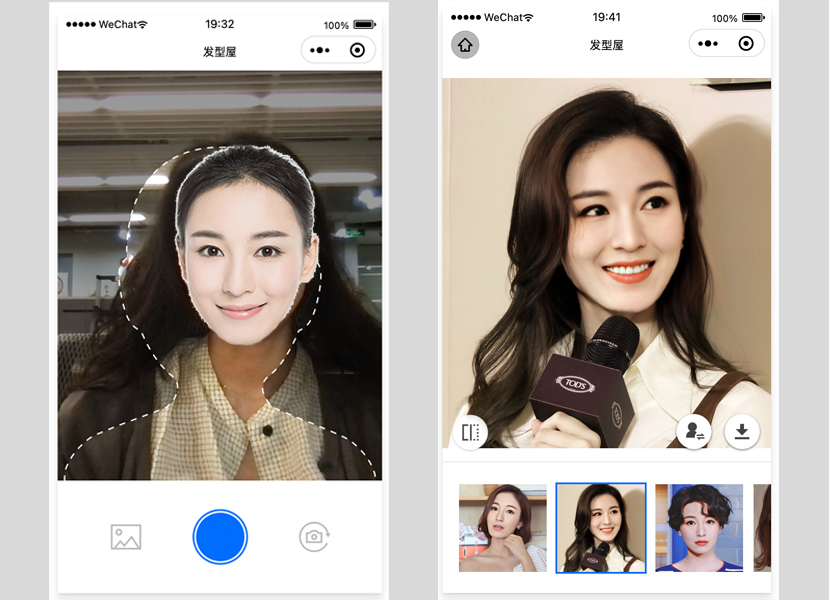
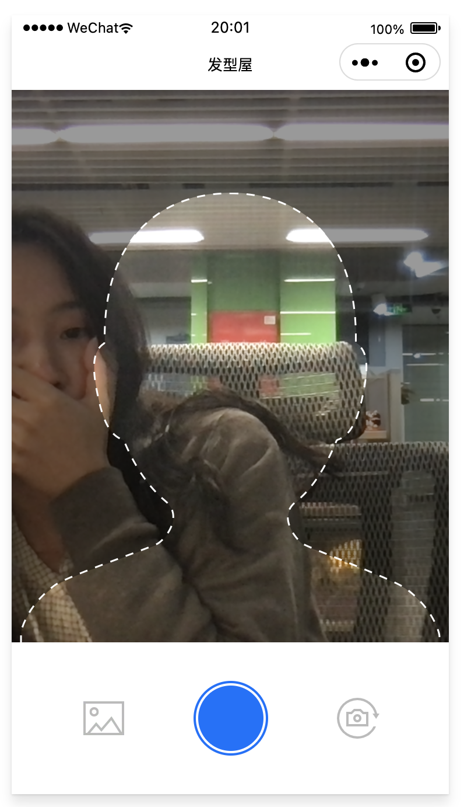
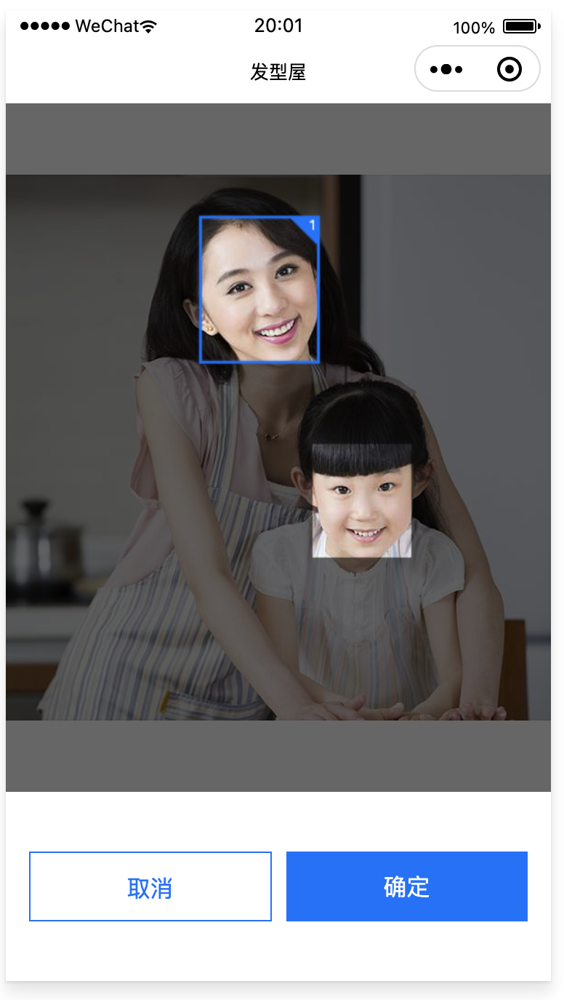
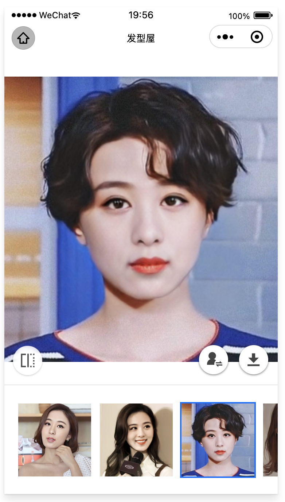
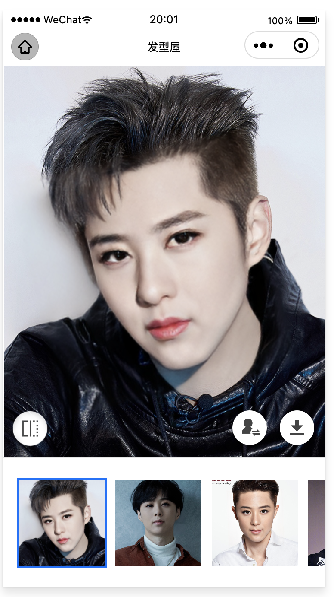

# 发型屋小程序

人脸融合实现你的发型屋

/packages/cloud  服务端云函数源码  
/packages/client 小程序端源码

## 作品介绍
通过人脸融合功能，将用户的自拍与模板进行融合，从而生成发型的预览功能。
为想换发型而又选择困难的同学提供一些参考和建议~

## 功能模块介绍  
1. 拍照/上传图片
用户可在此进行自拍，或上传已有人脸照片

 
2. 人脸确认
如果上传的照片不止包含一张人脸，需要用户进行确认，同时上传照片会经过安全措施（鉴政、鉴黄等），
确保人脸融合生成图片合规

3. 发型生成
并发地生成各种发型（长发7款+短发7款），左下角按钮切换原图查看对比效果，右下角按钮可切换性别和下载图片

